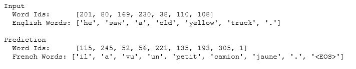

## Translate a Language
Language: Python (NumPy, TensorFlow)  
Built and trained a Recurrent Neural Network and a Sequence to Sequence model
on a dataset of English and French sentences that can translate new sentences from English to French.

 

  

